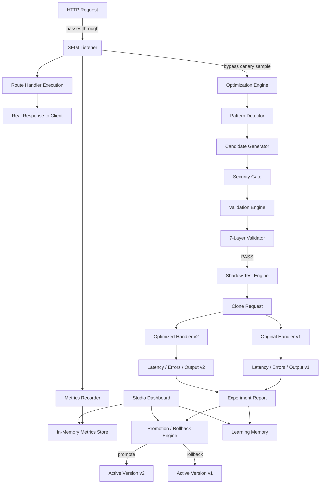

# SEIM — Self-Evolving Infrastructure Middleware

## Executive Summary

SEIM is an Express.js middleware runtime that turns a passive application into a self-improving backend. It observes traffic, analyzes route-level code, proposes validated optimizations, runs them as shadow implementations, and promotes only the versions that are provably correct, secure, and faster. The system operates in two modes: `restrict` (observe-and-suggest) and `bypass` (observe, validate, experiment, and auto-promote).

---

## 1. High-Level Architecture

SEIM wraps an Express application as a thin, safe middleware layer. It does not modify the host process unless explicitly configured to `bypass` mode, and every modification must pass a seven-layer validation gate.

```
┌─────────────────────────────────────────────────────────────────┐
│                         Express App                             │
│  ┌─────────────┐  ┌─────────────┐  ┌───────────────────────┐  │
│  │   Route A   │  │   Route B   │  │   Route C (/v1/*)     │  │
│  │ seim.listen │  │ seim.listen │  │ seim.listener() group │  │
│  └──────┬──────┘  └──────┬──────┘  └───────────┬─────────────┘  │
│         │                │                     │               │
│         └────────────────┴─────────────────────┘               │
│                              │                                  │
│                    ┌─────────┴─────────┐                        │
│                    │   SEIM Runtime    │                        │
│                    │  ───────────────  │                        │
│                    │  Observe         │                        │
│                    │  Analyze         │                        │
│                    │  Improve         │                        │
│                    │  Validate        │                        │
│                    │  Experiment      │                        │
│                    │  Promote         │                        │
│                    │  Learn           │                        │
│                    └─────────┬─────────┘                        │
│                              │                                  │
│         ┌────────────────────┼────────────────────┐             │
│         ▼                    ▼                    ▼             │
│  ┌──────────────┐   ┌──────────────┐   ┌─────────────────┐    │
│  │   Metrics    │   │  Validation  │   │  Learning Store │    │
│  │    Store     │   │    Engine    │   │                 │    │
│  └──────────────┘   └──────────────┘   └─────────────────┘    │
└─────────────────────────────────────────────────────────────────┘
```

---

## 2. Detailed Architecture Diagram



---

## 3. Package Structure

```
seim/
├── package.json
├── tsconfig.json
├── dist/                  # compiled JavaScript + declarations
├── src/
│   ├── index.ts           # public factory: seim(config)
│   ├── types.ts           # TypeScript domain models
│   ├── config.ts          # defaults and merge logic
│   ├── middleware.ts      # Express listener + dashboard wiring
│   ├── metrics.ts         # runtime & traffic metrics collection
│   ├── optimization.ts    # code pattern detection + suggestion
│   ├── validation.ts      # 7-layer correctness validator
│   ├── shadow.ts          # shadow / canary testing harness
│   ├── rollback.ts        # promotion and rollback decisioning
│   ├── security.ts        # static security gates
│   ├── learning.ts        # optimization memory
│   └── studio.ts          # dashboard request handler
├── ARCHITECTURE.md
└── examples/
    ├── basic.js
    └── bypass.js
```

---

## 4. npm Package API

### Installation

```bash
npm install seim
```

### Factory

```ts
import seim from 'seim';

const s = seim({
  mode: 'restrict',      // or 'bypass'
  studioPath: '/asdfghjklkjhgfdsasdfghj',
  businessRules: [
    (response: any) => response.total >= 0,
    (response: any) => response.items?.length <= 1000,
  ],
  experiment: {
    confidenceThreshold: 0.92,
    canaryPercent: 5,
    rollbackLatencyMs: 1.2,
    rollbackErrorRate: 1.5,
    minSampleSize: 100,
  },
});
```

### Usage Patterns

```js
const express = require('express');
const seim = require('seim').default;
const app = express();
const s = seim({ mode: 'restrict' });

// Route level
app.get('/system-report', s.listener(), systemReportHandler);

// Group level
app.use('/v1', s.listener());

// Dashboard
app.use(s.config.studioPath, s.dashboard);

app.listen(3000);
```

### Configuration Options

| Field | Type | Default | Description |
|-------|------|---------|-------------|
| `mode` | `'restrict' \| 'bypass'` | `'restrict'` | Restrict only observes; bypass can auto-promote. |
| `studioPath` | `string` | `'/asdfghjklkjhgfdsasdfghj'` | URL for the Studio dashboard. |
| `businessRules` | `BusinessRule[]` | `[]` | User invariants evaluated against responses. |
| `securityRules` | `SecurityRule[]` | `[]` | Custom code-level security checks. |
| `ai` | `object` | disabled | LLM endpoint config for generator/reviewer/verifier. |
| `experiment` | `object` | thresholds | Canary and rollback parameters. |
| `storage` | `object` | in-memory | Metrics & memory backend. |
| `security` | `object` | strict | Static guards for auth/authz/payment/secret. |
| `learning` | `object` | enabled | Whether optimization memory is kept. |

---

## 5. Internal Modules

| Module | Responsibility |
|--------|--------------|
| `index.ts` | Public factory; composes all subsystems into a `SeimInstance`. |
| `config.ts` | Defaults, merging, normalization. |
| `middleware.ts` | `seim.listener()` Express middleware; intercepts requests/responses; triggers canary shadow testing on finish. |
| `metrics.ts` | Rolling histograms, percentiles (p95, p99), throughput, error rates, memory/CPU. |
| `optimization.ts` | Regex/AST-lite pattern detection; generates candidate optimized code snippets. |
| `validation.ts` | Seven-layer correctness validator (schema, equivalence, business, unit, integration, security, AI critic). |
| `shadow.ts` | Clones `req` to a stub `res`; runs v1 and v2 in isolation; collects latency/error/output. |
| `rollback.ts` | Registers shadow pairs; evaluates experiment reports; decides promote, rollback, or continue. |
| `security.ts` | Blocks changes to authentication, authorization, payment, and secret usage. |
| `learning.ts` | Stores problem/solution pairs with success and improvement rates. |
| `studio.ts` | HTML/JSON dashboard request handler. |

---

## 6. Database / Storage Design

SEIM is storage-agnostic. The default implementation keeps metrics and learning records in memory, bounded to 10k samples per route. Production deployments can switch to SQLite or Redis.

### In-Memory (default)

```ts
class InMemoryMetricsStore implements MetricsStore {
  private routes: Map<string, RouteMetrics> = new Map();
  // bounded rolling arrays for durations, response sizes, payload sizes
}
```

### SQLite Schema (future)

```sql
CREATE TABLE metrics (
  id INTEGER PRIMARY KEY,
  route_key TEXT NOT NULL,
  duration_ms REAL,
  status_code INTEGER,
  response_size INTEGER,
  payload_size INTEGER,
  error BOOLEAN,
  timeout BOOLEAN,
  timestamp INTEGER
);
CREATE INDEX idx_metrics_route ON metrics(route_key);
CREATE INDEX idx_metrics_time ON metrics(timestamp);

CREATE TABLE optimizations (
  id TEXT PRIMARY KEY,
  route_key TEXT,
  pattern TEXT,
  severity TEXT,
  original_code TEXT,
  optimized_code TEXT,
  confidence REAL,
  status TEXT,
  created_at INTEGER,
  updated_at INTEGER
);

CREATE TABLE learning (
  problem TEXT,
  solution TEXT,
  framework TEXT,
  success_count INTEGER,
  failure_count INTEGER,
  average_improvement REAL,
  last_used INTEGER
);
```

### Redis (future)

- `seim:metrics:<route>:durations` — sorted set with TTL
- `seim:learning:<hash>` — hash of optimization memory
- `seim:shadow:<route>` — active shadow version metadata

---

## 7. AI Agent Design

The AI layer is intentionally optional and pluggable. When `ai.enabled` is true, SEIM uses a three-agent loop:

### Agent 1 — Generator

- Input: route source code, middleware chain, metrics, detected pattern.
- Output: optimized candidate code.
- Instructions: only return refactors that preserve observable behavior; avoid auth/authz/payment blocks.

### Agent 2 — Reviewer

- Input: original code, generated code, diff.
- Output: review comments + `approve` / `reject`.
- Instructions: focus on correctness, security, business-invariant preservation, and performance.

### Agent 3 — Verifier

- Input: generated code, static analysis, sample inputs/outputs.
- Output: final verification report.
- Instructions: prove or disprove response equivalence and side-effect equivalence.

### Prompt Guardrails

- Code is wrapped in an AST-aware prompt with clear boundaries.
- Output is parsed from fenced code blocks only.
- No system instructions are allowed to override business rules or security policies.
- All generated code is denied network access by default (lint + sandbox).

---

## 8. Experimentation Framework

1. **Sampling**: In `bypass` mode, a configurable percentage of requests (`canaryPercent`) are selected for shadow testing.
2. **Cloning**: The incoming `req` object is reused; a stub `res` captures the output without touching the client.
3. **Dual Execution**: v1 (current) and v2 (optimized) execute sequentially in an isolated `try/catch`.
4. **Metrics**: p95/p99 latency, error rate, memory, CPU.
5. **Decision**: `RollbackEngine.evaluate` checks thresholds and returns `promote`, `rollback`, or `continue`.
6. **Promotion**: A promoted version becomes the active handler; the Studio dashboard logs the change.

### Thresholds

| Metric | Default | Action |
|--------|---------|--------|
| v2 error rate > v1 error rate * 1.5 | `rollbackErrorRate = 1.5` | rollback |
| v2 latency > v1 latency * 1.2 | `rollbackLatencyMs = 1.2` | rollback |
| sample size >= 100, v2 faster, v2 fewer/same errors | `minSampleSize = 100` | promote |
| confidence < 0.92 | `confidenceThreshold = 0.92` | continue |

---

## 9. Validation Framework

Every candidate must pass seven layers. The priority order is absolute:

```
Correctness > Security > Business Rules > Performance
```

### Layer 1 — Schema Validation

Ensure the optimized handler compiles and its exported shape matches the original.

### Layer 2 — Response Equivalence

Shadow-test outputs are compared. Differences in order are allowed for unordered arrays if configured.

### Layer 3 — Business Rules

User-defined invariants:

```ts
seim({
  businessRules: [
    response => response.total >= 0,
    response => response.items.length <= 1000,
  ]
})
```

### Layer 4 — Existing Unit Tests

`npm test` is executed in a sandbox against the generated version.

### Layer 5 — Integration Tests

A replay corpus of real requests is run against both versions.

### Layer 6 — Security Validation

- No authentication/authorization mutation.
- No payment logic mutation.
- No secret leakage.
- No `eval`, `new Function` with untrusted input (except the signed SEIM pipeline).

### Layer 7 — AI Critic Agent

A separate LLM reviews the generator's output. It can reject even if all earlier layers pass.

---

## 10. Studio Dashboard Design

Default path: `/asdfghjklkjhgfdsasdfghj` (configurable via `studioPath`).

### Dashboard Sections

1. **Endpoint Explorer** — list of all observed routes and their source snippets.
2. **API Health** — system uptime, memory, CPU, healthy flag.
3. **Latency Graphs** — p50/p95/p99 over time.
4. **Error Trends** — error rate per route and aggregate.
5. **Hot Routes** — top N by request count and latency.
6. **Optimization Suggestions** — pending candidates with severity and confidence.
7. **Approval Center** — one-click approve/reject for `restrict` mode.
8. **Version History** — promoted and rolled-back versions with timestamps.
9. **Evolution Timeline** — chronological view of changes.
10. **Rollback History** — reasons and timestamps of rollbacks.
11. **Security Reports** — blocked changes and rule triggers.
12. **Correctness Reports** — per-candidate validation layer results.

### API Endpoints

- `GET <studioPath>` — HTML dashboard
- `GET <studioPath>/api/status` — JSON status
- `GET <studioPath>/api/metrics` — full metrics snapshot
- `POST <studioPath>/api/candidates/:id/approve` — manual promotion
- `POST <studioPath>/api/candidates/:id/reject` — manual rejection

---

## 11. Security Architecture

Security is enforced at multiple layers:

| Layer | Mechanism |
|-------|-----------|
| Static guards | `security.ts` blocks auth/authz/payment/secret patterns. |
| Custom rules | `securityRules` callbacks inspect old vs new code. |
| Prompt hardening | System instructions, output fences, no override. |
| Sandboxing | Generated code runs in a child process or VM with no network. |
| Secret scanning | Reject code containing `process.env.*SECRET|KEY|PASSWORD|TOKEN` and hardcoded secrets. |
| Least privilege | Default mode is `restrict`; `bypass` requires explicit opt-in. |

---

## 12. Rollback Architecture

Rollback must be instant. SEIM keeps the original handler reference in `RollbackEngine.activeVersions`:

```ts
class RollbackEngine {
  private activeVersions: Map<string, { original, optimized, active }>;
  evaluate(report): 'promote' | 'rollback' | 'continue';
  rollback(routeKey, reason);
  promote(routeKey);
}
```

A promoted version can be rolled back in a single map swap. If an error spike is detected, the rollback occurs before the next request is served.

---

## 13. Deployment Architecture

SEIM is distributed as an npm package and is deployed as a library, not a sidecar.

```
┌─────────────────────┐
│  Node / Express App │
│  + seim middleware  │
└──────────┬──────────┘
           │
     ┌─────┴──────┐
     ▼            ▼
  Redis       SQLite / PostgreSQL
  (metrics)     (long-term history)
```

### Modes

- **Embedded**: `npm install seim` in the host Express app.
- **Sidecar (future)**: a small agent process consumes OpenTelemetry traces and runs optimization outside the host.
- **Enterprise Gateway (future)**: reverse proxy with SEIM intelligence.

---

## 14. Scalability Strategy

- **Stateless core**: the listener is stateless; metrics and learning can be externalized.
- **Sampling**: only `canaryPercent` of requests shadow-test; observability is always on.
- **Bounded memory**: rolling arrays prevent unbounded growth.
- **Aggregation**: in multi-instance deployments, metrics can be flushed to a central Redis/DB.
- **Horizontal scaling**: each process runs its own SEIM; promotion decisions are quorum-aware in enterprise edition.

---

## 15. Failure Modes

| Failure | Impact | Mitigation |
|---------|--------|------------|
| Generated code fails to compile | Candidate rejected | try/catch around `buildOptimizedHandler`; validation fails. |
| Optimized handler throws | Experiment report marks v2Error; rollback or reject. | Shadow tests do not affect the client. |
| Validation layer is slow | Adds latency to canary requests | Async on `res.finish`; configurable sample rate. |
| AI hallucinates unsafe code | Static security gates and AI critic reject it. |
| Rollback engine keeps bad version | Version map toggles are atomic; health checks force rollback. |
| Metrics store OOM | Bounded arrays; external storage in production. |

---

## 16. Open-Source Roadmap

| Phase | Deliverable |
|-------|-------------|
| 0.1.0 | Core middleware, metrics, Studio dashboard, restrict mode |
| 0.2.0 | Pattern detector, suggestion engine, validation scaffold |
| 0.3.0 | Bypass mode, shadow testing, rollback engine |
| 0.4.0 | AI agent integration (OpenAI, local models) |
| 0.5.0 | SQLite/Redis storage adapters |
| 0.6.0 | Unit/integration test runner integration |
| 1.0.0 | Stable API, full documentation, community governance |

License: MIT for core. Enterprise plugins are source-available or commercial.

---

## 17. MVP Definition

The MVP (v0.1.0) must:

1. Install as `npm install seim`.
2. Provide `seim({ mode: 'restrict' })` and `seim({ mode: 'bypass' })`.
3. Attach at route and group level with `s.listener()`.
4. Collect request count, p95, p99, error rate, throughput, memory, CPU.
5. Detect sequential async, N+1, missing cache, inefficient loops, redundant serialization, blocking ops.
6. Generate plain-text suggestions.
7. Expose the Studio dashboard at the default hidden path.
8. Never modify production code unless `bypass` is enabled and all gates pass.

---

## 18. Enterprise Edition Ideas

- **RBAC for Studio**: role-based dashboard access.
- **Centralized policy server**: enterprise-wide allowed/banned patterns.
- **Git integration**: PR generation from promoted optimizations.
- **SLO-aware promotion**: integrate with Datadog/New Relic/Service-Level Objectives.
- **Multi-region canary**: promote by geography and traffic segment.
- **Audit logs**: immutable history of every AI-generated change.
- **SOC 2 / HIPAA / PCI helpers**: compliance reports and restricted optimization zones.

---

## 19. Technical Risks

| Risk | Severity | Mitigation |
|------|----------|------------|
| AI-generated correctness bugs | Critical | 7-layer validation, shadow testing, rollback. |
| Prompt injection | High | Prompt boundaries, output parsing, no override. |
| Performance overhead of shadow tests | Medium | Sampling, async off the client path, bounded memory. |
| Model bias toward common frameworks | Medium | Learning memory + per-application pattern training. |
| Dependency on Express internals | Medium | Keep adapter layer; plan Fastify/Koa adapters. |
| Security of generated `AsyncFunction` | High | Never allow dynamic user input into generated code; sandbox. |

---

## 20. Research Opportunities

- **Neural program equivalence**: train a model to prove endpoint output equivalence.
- **Reinforcement learning from human feedback (RLHF)**: reward optimizations that survive production.
- **Semantic code search**: retrieve optimization templates from a vector database of real-world Express apps.
- **Differential performance attribution**: decompose latency by middleware, DB query, and serialization.
- **Self-healing under load**: auto-rollback combined with autoscaling signals.

---

## 21. Competitive Moat

1. **Safety-first design**: most tools only observe; SEIM validates before promotion.
2. **Seven-layer correctness gate**: a defensible, auditable validation pipeline.
3. **Learning memory**: proprietary corpus of which optimizations work in which framework contexts.
4. **Integrated dashboard**: a single pane for observability, optimization, and approval.
5. **Open-core model**: free core drives adoption; enterprise features monetize large teams.
6. **Vendor stickiness**: once SEIM learns a codebase's business rules, switching cost is high.

---

## 22. Detailed Implementation Phases

### Phase 1 — Foundation (Weeks 1-2)

- Set up package, TypeScript, lint, test harness.
- Implement `listener()`, metrics collection, and `InMemoryMetricsStore`.
- Build `SeimConfig` and default merging.
- Serve Studio dashboard with live metrics.

### Phase 2 — Analysis (Weeks 3-4)

- Add `OptimizationEngine` with regex/AST-lite pattern detection.
- Implement `SecurityGate` with auth/authz/payment/secret blocks.
- Add `businessRules` validation.

### Phase 3 — Validation (Weeks 5-6)

- Implement all seven validation layers.
- Integrate `npm test` and integration test stubs into the pipeline.
- Add AI critic stubs with configurable endpoints.

### Phase 4 — Shadow & Promotion (Weeks 7-8)

- Build `ShadowTestEngine` with dual execution and stub response capture.
- Implement `RollbackEngine` with thresholds.
- Wire canary sampling in `middleware.ts`.

### Phase 5 — Storage & Scale (Weeks 9-10)

- Add SQLite and Redis adapters.
- Implement metric flushing and cross-instance aggregation.
- Bound memory and add eviction policies.

### Phase 6 — Enterprise Hardening (Weeks 11-12)

- Audit logging, RBAC, policy server.
- Git integration and PR generation.
- Security review, load testing, documentation.

---

## Conclusion

SEIM is designed to become the GitHub Copilot for running backend systems: a safe, observable, self-improving layer that turns operational data into verified, incremental performance gains without sacrificing correctness, security, or business rules.
